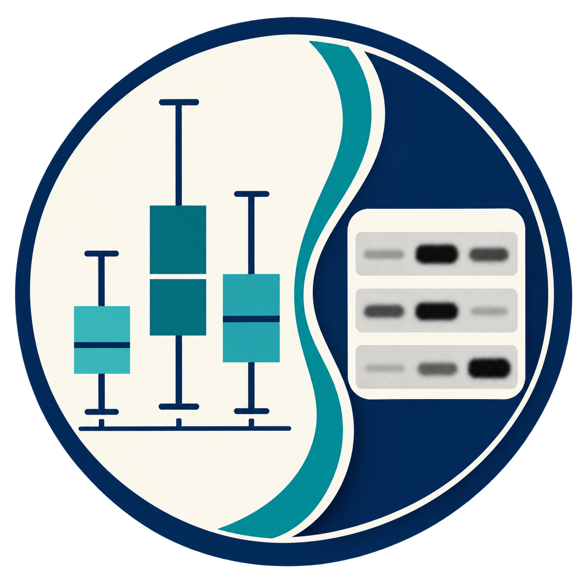

  

# Plot & Blot

Life-science software for clear, traceable research outputs.

[English](#english) | [日本語](#日本語)

## English

Plot & Blot is the umbrella name for two independent, local-first research applications created
and maintained by Hironori Inaba. Each product has its own repository, documentation, release
cycle, and issue tracker.

### BioFigureStat

BioFigureStat is a desktop application for structuring life-science experiments, entering data,
running deterministic local statistics, and creating research graphs. It starts from experimental
facts rather than a test name and keeps biological `n`, pairing, nesting, repeated identity,
analysis provenance, and Graph state explicit.

- Status: Public Alpha
- Platforms: Windows 11 x64 and Apple Silicon macOS
- [Repository and documentation](https://github.com/bonnginn/biofigurestat)
- [Download the Public Alpha](https://github.com/bonnginn/biofigurestat/releases/tag/v0.1.0-alpha.1)

### BlotCanvas

BlotCanvas is a free browser application for preparing publication and presentation figures from
Western blot images, retaining source records, and performing preliminary quantification. Images
are processed in the user's browser and are not uploaded to an application server.

- Status: Public Beta
- Platform: Browser; current Chrome recommended
- [Open BlotCanvas](https://bonnginn.github.io/blotcanvas/)
- [User manual](https://bonnginn.github.io/blotcanvas/manual.html)
- [Repository and documentation](https://github.com/bonnginn/blotcanvas)

### Shared approach

- Local-first handling of research data.
- Explicit source records, transformations, and analysis boundaries.
- Safe stops instead of silently forcing unsupported scientific workflows.
- Researcher review remains necessary before using outputs in publications or decisions.
- Open-source distribution under the MIT License.

For detailed privacy, security, limitations, and reporting information, see the documentation in
the relevant product repository.

### About this repository

This repository is the public landing page for Plot & Blot. Product source code and product-specific
issues remain in the [BioFigureStat](https://github.com/bonnginn/biofigurestat) and
[BlotCanvas](https://github.com/bonnginn/blotcanvas) repositories.

## 日本語

Plot & Blotは、Hironori Inabaが開発・保守する、2つの独立したローカルファースト研究用
アプリケーションの上位名称です。各製品は、それぞれ別のリポジトリ、ドキュメント、
リリース周期、不具合管理先を持ちます。

### BioFigureStat

BioFigureStatは、生命科学実験の構造整理、データ入力、決定論的なローカル統計解析、研究用Graphの
作成を行うデスクトップアプリケーションです。統計手法名ではなく実験で行ったことの確認から始め、
biological `n`、対応、階層、反復測定における同一性、解析の由来、Graphの状態を明示的に保持します。

- 公開状況：Public Alpha
- 対応環境：Windows 11 x64、Apple Silicon macOS
- [リポジトリとドキュメント](https://github.com/bonnginn/biofigurestat)
- [Public Alphaをダウンロード](https://github.com/bonnginn/biofigurestat/releases/tag/v0.1.0-alpha.1)

### BlotCanvas

BlotCanvasは、Western blot画像から論文・学会発表用Figureを作成し、元画像記録を保持しながら
初期的な定量を行う無料のブラウザアプリケーションです。画像は利用者のブラウザ内で処理され、
アプリケーションサーバーへアップロードされません。

- 公開状況：Public Beta
- 対応環境：ブラウザ（現時点ではChromeを推奨）
- [BlotCanvasを開く](https://bonnginn.github.io/blotcanvas/)
- [使い方を見る](https://bonnginn.github.io/blotcanvas/manual.html)
- [リポジトリとドキュメント](https://github.com/bonnginn/blotcanvas)

### 共通する方針

- 研究データをローカル中心に取り扱います。
- 元データの記録、変換、解析の境界を明示します。
- 未対応の科学的ワークフローを、近い処理へ黙って置き換えず、安全に停止します。
- 論文や研究上の判断へ利用する前に、研究者自身による出力内容の確認が必要です。
- MIT Licenseによるオープンソース配布を行います。

プライバシー、セキュリティ、既知の制限、不具合報告については、各製品リポジトリの
ドキュメントを参照してください。

### このリポジトリについて

このリポジトリは、Plot & Blotの公開案内ページです。製品のソースコードと製品固有の不具合は、
[BioFigureStat](https://github.com/bonnginn/biofigurestat)または
[BlotCanvas](https://github.com/bonnginn/blotcanvas)の各リポジトリで管理します。

## License / ライセンス

The contents of this repository are available under the [MIT License](LICENSE).

このリポジトリの内容は[MIT License](LICENSE)で公開しています。
